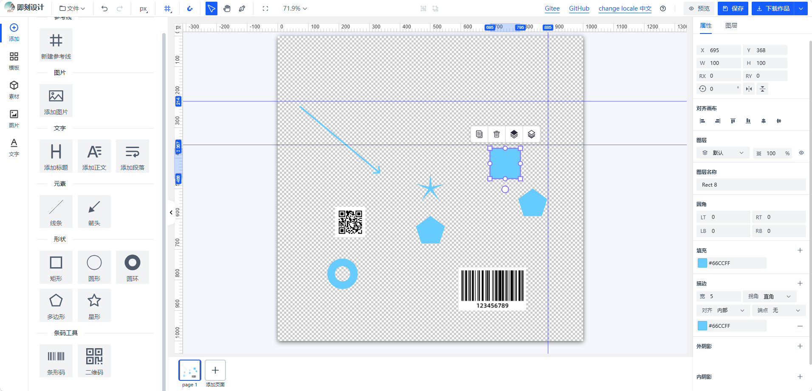

# 即刻设计（InstantDesign）

> 基于 [LeaferJS](https://www.leaferjs.com/) + Vue 3 + TypeScript 构建的开源海报设计器，开箱即用、深度可扩展。

[](LICENSE)

[英文文档 English](./README.en.md)



## 简介

即刻设计是一款免费开源的海报 / 图片设计工具，以 **LeaferJS** 高性能渲染引擎为核心，内建完整的多页面画布、图层、历史记录、快捷键、右键菜单、标尺辅助线、吸附等能力，并提供一套**事件总线**、**插件系统** 与 **layoutOptions 深度配置系统**，让二次开发像搭积木一样简单。

### 核心功能

- **画布能力**：拖拽平移、滚轮缩放、多页面管理、图层树操作、编组 / 取消编组
- **元素支持**：文本、矩形、椭圆、多边形、星形、路径绘制、图片，以及扩展的**二维码 / 条形码**
- **PSD 导入**：直接导入 PSD 设计稿，无缝衔接设计流程
- **历史记录**：基于多页面的撤销 / 重做栈，可自定义步数与开关
- **生产力工具**：右键菜单、快捷键、标尺 + 网格辅助线、智能吸附、导出（图片 / JSON）
- **深度定制**：UI 布局、插槽、数据 API 均可通过 `layoutOptions` 与 `apis` 注入

### 适用场景

- 海报 / 广告设计、Logo 制作、AI 图片合成
- 二维码推广海报、电商产品图、名片设计
- 节假日海报、社交媒体配图等图片编辑处理

## 技术栈

| 类别 | 技术 |
| --- | --- |
| 渲染引擎 | LeaferJS 2.1（leafer-ui、@leafer-in/editor、viewport、text-editor、arrow、animate 等） |
| 前端框架 | Vue 3.5 + TypeScript 5.9 |
| 构建工具 | Vite 7 + Vue Router + Pinia(可选) |
| UI 组件 | Arco Design Vue、Vant 4 |
| 样式方案 | UnoCSS、Less |
| 工具库 | i18next（国际化）、ag-psd（PSD 解析）、Mousetrap（快捷键）、qrcode / jsbarcode、leafer-x-easy-snap（吸附） |

## 快速开始

```bash
# 环境要求：Node.js ^20.19.0 或 >=22.12.0
npm install        # 安装依赖
npm run dev        # 启动开发服务
npm run build      # 类型检查 + 生产构建
npm run preview    # 预览构建产物
```

## 项目结构

```plain
src/
├── LeaferEditor/            # 设计器内核（可复用的核心库）
│   ├── core/                # 引擎核心
│   │   ├── editor.ts        # LeaferEditor 主类（入口，继承 PluginHost）
│   │   ├── canvas.ts        # 画布 / 页面抽象
│   │   ├── managers/        # 七大管理器：Page / History / Layer / Mode / Image / Clipboard / Font
│   │   ├── events/          # 事件系统（MittBus 类型安全事件总线 + EventTypes）
│   │   ├── pluginHost/      # 插件宿主系统（PluginHost + 接口定义）
│   │   ├── shapes/          # 扩展图形：二维码 / 条形码 / 表格
│   │   └── interfaces/      # 核心类型定义
│   ├── plugins/             # 内置插件：快捷键 / 右键菜单 / 标尺 / 工具栏 / 吸附
│   ├── layouts/             # Vue 布局层（layout.vue 壳组件 + 左右面板 + 属性面板）
│   │   ├── layoutOptions.ts # layoutOptions 配置系统（本节重点之一）
│   │   └── panel/           # 左侧素材面板、右侧属性 / 图层面板
│   ├── i18n/                # 内核级国际化
│   ├── proxyData/           # 响应式代理数据（选中状态联动 UI）
│   └── utils/               # 工具函数（含 PSD 解析器）
├── views/                   # 页面视图（HomeView 组装编辑器）
├── mock/                    # Mock 数据与默认 API 实现
└── locales/                 # 应用级国际化文案
```

---

## 核心系统

### 一、事件系统（Event System）

内核内置了一个**全类型安全**的事件总线 `MittBus`（`src/LeaferEditor/core/events/`），编辑器实例通过 `editor.eventBus` 暴露，用于页面、画布、选中、历史、导出等全生命周期事件的监听与派发。

#### 类型安全

`EventTypes` 枚举定义了所有事件名，`EventsParam` 映射表为每个事件指定了参数类型。监听时无需任何断言即可获得正确类型：

```typescript
// 参数类型由 EventsParam[EventTypes.selected] 自动推断为 IUI[]
editor.eventBus.on(editor.Events.selected, (list) => {
    console.log('当前选中：', list)
})

editor.eventBus.on(editor.Events.canvasZoomChange, (scale) => {
    console.log('缩放比例：', scale) // number
})
```

#### 主要事件分类

| 分类 | 事件 |
| --- | --- |
| 页面生命周期 | `pageAddBefore / pageAddAfter`、`pageChangeBefore / pageChangeAfter`、`pageRemoveBefore / pageRemoveAfter` |
| 画布 | `canvasAddBefore / canvasAddAfter`、`canvasChange`、`canvasResize`、`canvasRemoveBefore / canvasRemoveAfter` |
| 选中状态 | `selectedBefore`、`selected`、`cancelSelected` |
| 视图 | `canvasZoomChange` |
| 模式 / 历史 | `changeMode`、`undoRedoStackChange`、`historyStateSavedAfter` |
| 加载（导入） | `loadBefore / loadAfter`（仅在 `reload` / `reloadFromJSON` / `appendPagesFromJSON` 时触发） |
| 图片 | `imageLocalUploadSuccess / imageLocalUploadError` |

#### MittBus API

```typescript
eventBus.on(type, handler)      // 订阅（泛型参数自动推断）
eventBus.off(type, handler)     // 取消订阅
eventBus.once(type, handler)    // 只触发一次
eventBus.emit(type, param)      // 派发
eventBus.stop() / start()       // 暂停 / 恢复派发
eventBus.clear(type?)           // 清空（可选按类型）
// 非类型化的外部事件通道，用于与第三方库 / 后端推送对接
eventBus.onExternal(name, fn)   // 订阅外部事件
eventBus.emitExternal(name, o)  // 派发外部事件
```

**健壮性设计**：单个监听器抛出异常不会影响其他监听器执行，错误会被拦截并输出带事件名、处理器名、参数详情的诊断日志；`emit` 期间动态增删监听器也不会引发迭代异常。

---

### 二、插件系统（Plugin System）

内核基于自研的**插件宿主**（`src/LeaferEditor/core/pluginHost/`）实现了一套完整的插件机制：任何类继承 `PluginHost` 即自动获得「插件安装 / 卸载、服务注册 / 查询、依赖检查、生命周期钩子」等能力。`LeaferEditor` 本身即 `PluginHost` 的子类，因此**所有核心能力均由插件提供**。

#### 核心接口

```typescript
interface IPlugin<T, O> {
    name: string                 // 插件唯一标识
    install(host, options?)      // 安装钩子（必须实现）
    uninstall?(host)             // 卸载钩子（可选）
    dependentPlugins?: string[]  // 依赖的其他插件
    dependentServices?: string[] // 依赖的服务
}
```

插件通过 `host.registerServiceFor(plugin, name, service)` 对外暴露能力，其他插件或业务代码用 `editor.getService(name)` 获取：

```typescript
// 自定义插件示例
class WatermarkPlugin implements IPlugin {
    name = 'Watermark'
    install(host, options) {
        const editor = host.getInstance()          // 拿到编辑器实例
        const ruler = editor.getService<IRulerPluginService>('Ruler') // 使用别的插件服务
        host.registerServiceFor(this, 'Watermark', this)              // 注册自己的服务
    }
    uninstall(host) { host.unregisterService('Watermark') }
}

editor.use(new WatermarkPlugin(), { text: '即刻设计' }) // 安装
editor.getService('Watermark')                          // 使用
```

> **关于 `install(host, options)` 的 `host`**：由于 `LeaferEditor` 继承了 `PluginHost`，`editor.use(plugin, options)` 内部执行的是 `plugin.install(this, options)`，因此传入的 `host` 就是**编辑器实例本身**（`host === editor`）。你可以直接通过 `host` 访问编辑器 API 与插件服务（`host.getService(...)`、`host.registerServiceFor(...)` 等）；`host.getInstance()` 与之等价，仅用于拿到类型化引用。

#### 生命周期状态机

每个插件都拥有运行时状态，安装卸载过程会经历完整的状态流转：

```plain
pending → installing → installed → uninstalling → uninstalled
                  ↘            ↘
                   error        error（安装 / 卸载失败）
```

卸载时会自动执行三件清理工作：移除该插件注册的**事件钩子**、注销其注册的**全部服务**、调用插件的 `uninstall()`。

#### 内置插件一览

| 插件 | 服务名 | 能力 |
| --- | --- | --- |
| `ShortcutPlugin` | `shortcut` | 快捷键系统（基于 Mousetrap，可绑定/触发组合键，支持全局/实例级作用域） |
| `ContextMenuPlugin` | `ContextMenu` | 右键菜单，支持按 `ONE / SOME / ZERO / ALL` 场景注册、级联子菜单、显示/禁用条件 |
| `RulerPlugin` | `Ruler` | 标尺 + 网格辅助线（多单位切换、DPi、页面间辅助线迁移） |
| `ToolBarPlugin` | `toolBar` | 选中对象的浮动操作条（按单选/多选场景增删按钮） |
| `SnapPlugin` | `snap` | 吸附（自动吸收 Ruler 插件的网格辅助线参与对齐） |

`layout.vue` 中展示了标准的装配方式：

```typescript
const editor = markRaw(createLeaferEditor(coreOptions))
editor.use(new RulerPlugin(), ruler)         // 带 options 安装
editor.use(new ShortcutPlugin(), shortcut)
editor.use(new ContextMenuPlugin())
editor.use(new ToolBarPlugin())
editor.use(new SnapPlugin())                 // Snap 依赖 Ruler 服务，可自动获取
```

> 插件间的协作方式：`SnapPlugin` 在 `install` 中通过 `editor.getService(RulerPluginName)` 读取标尺的网格线并纳入吸附元素集合；这展示了"依赖服务而非硬编码"的解耦设计。

---

### 三、layoutOptions 配置系统

`layoutOptions`（`src/LeaferEditor/layouts/layoutOptions.ts`）是**布局 UI 的深度配置层**。布局壳组件 `layout.vue` 接收 `options` 属性，通过 `mergeLayoutOptions` 将**用户配置与内置默认值深度合并**（并回退到编辑器 `coreOptions` 的同名项），再以 `provide` 注入，所有面板组件通过组合式 API 消费。

#### 配置入口

```vue
<LeaferEditorLayout
    :editorOptions="editorOptions"   <!-- 内核配置 + 插件 options -->
    :options="options"               <!-- layoutOptions 布局配置 -->
    :apis="apis"                     <!-- 素材/字体数据接口 -->
    :sloganName="sloganName"
    logoUrl="/logo.png"
/>
```

#### 配置项总览

| 配置项 | 说明 |
| --- | --- |
| `theme` | 默认填充 / 描边 / 阴影颜色 |
| `image` | 图片上传的允许类型、大小上限、预览尺寸 |
| `font` | 字号预设、预览文本、字体加载超时等 |
| `shape` | 各类图形（矩形/圆/星形/二维码/条形码…）的默认尺寸参数 |
| `pagination` | 左侧素材面板每页条数（可按面板单独配置） |
| `waterfall` | 素材瀑布流布局（断点、栅格间距、懒加载等） |
| `export` | 导出弹窗的文件类型、质量档位、默认表单、`onSave` 回调 |
| `materialDialog` | 素材弹窗缩略图尺寸 |
| `draw` | 画笔工具描边预设 |
| `thumbnail` | 底部页面缩略图与图层面板缩略图尺寸 |
| `helpShortcuts` | 「帮助」快捷键列表内容 |
| `headerActions` | 顶部栏自定义操作组件数组（如示例中的 GitHub 按钮） |
| `headerLeft` | 顶部左侧各功能开关（文件/撤销重做/标尺单位/网格线/吸附/模式/复制/缩放） |
| `previewComponent` | 自定义预览组件 |
| `slots` | **插槽系统**（见下） |
| `pageAddable` / `isShowFooterBar` / `isShowPageText` | 页面可增删 / 底部栏显隐 / 页面文字显隐 |

#### 插槽系统（Slots）

`slots` 允许对内置 UI 区域做**增删改排**：

- `attributeOne / attributeSome / attributeZero`：单选 / 多选 / 未选中时的右侧属性面板
- `leftPanel`：左侧素材面板（模板 / 图片 / 素材 / 文本 / 组件）
- `toolBar`：header工具条

每个插槽支持三种操作：

```typescript
options: {
    slots: {
        leftPanel: {
            hidden: ['material'],                       // 1. 隐藏内置面板
            order: { image: 1, template: 0 },           // 2. 调整内置面板顺序
            custom: [{                                 // 3. 注入自定义面板
                name: 'my-panel',
                label: '我的素材',
                icon: Icon,                             // Arco icon name
                order: 2,                               // 未指定则默认排在末尾
                component: MyMaterialPanel,             // 任意 Vue 组件
            }],
        },
        toolBar: {
            custom: [{ 
                name: 'align', 
                content: '对齐', 
                iconClass: 'i-xxx',  // 自定义图标类名 使用 uno icon class 'i-svg:XXX'
                onClick: () => {} 
            }],
        },
    },
}
```

运行时由 `resolveSlotList(builtin, config)` 完成「内置列表 + 自定义列表」的合并、隐藏过滤与按 `order` 排序，面板自动更新。

#### 组合式 API 消费

面板组件在任意层级通过 inject 直接读取配置：

```typescript
import { useLayoutOptions, useLayoutTheme, useLayoutApis } from '../layoutOptions'

const layoutOptions = useLayoutOptions()   // 完整配置（已合并默认值）
const theme = useLayoutTheme()             // theme 快捷访问
const apis = useLayoutApis()               // 素材/字体数据接口
```

#### 数据接口（LayoutApiOptions）

布局层不关心数据来源，通过 `apis` 注入字体、模板、素材的查询 / 上传接口（分页 + 分类 + 关键词），默认提供 `src/mock` 的 Mock 实现，接入真实后端时只需按接口签名替换：

```typescript
const apis: LayoutApiOptions = {
    queryFontList: (params) => http.get('/api/fonts', { params }),
    queryTemplateList: (params) => http.get('/api/templates', { params }),
    // ... 其余 10 个接口
}
```

---

## 二次开发建议

1. **不修改内核**：优先通过 `editor.use(Plugin)` 扩展能力、`options.slots` 调整 UI，避免改动 `LeaferEditor` 源码。
2. **监听事件**：需要感知状态变化时，订阅 `editor.eventBus`（如 `selected`、`undoRedoStackChange` 实现"未保存离开"提示）。
3. **自定义素材源**：实现并注入 `LayoutApiOptions`，替换默认 Mock。

## 注意

项目中部分资源（图片、字体等）来自互联网，使用时请遵守相关法律法规。如有侵犯版权，请联系我删除。

## 许可证

本项目基于 **MIT 许可证** 开源，作者 **Tian**。详见 [LICENSE](LICENSE)。

## 致谢

特别感谢以下项目为本项目提供参考与基础：

- [gzm-design](https://github.com/LvHuaiSheng/gzm-design)（UI / 交互参考）
- [LeaferJS](https://www.leaferjs.com/) 及其插件生态
